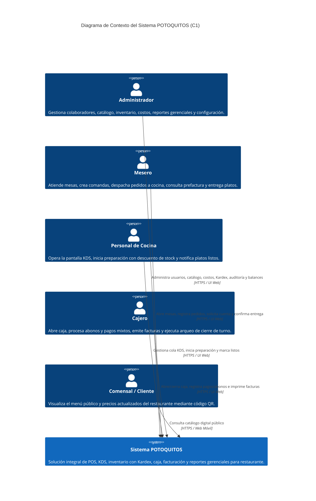

# C1 — Diagrama de Contexto del Sistema POTOQUITOS

El diagrama de contexto C1 define los límites del sistema **POTOQUITOS** y sus interacciones con los usuarios y actores del negocio en función de los roles y permisos reales (**RBAC**).

---

## 1. Actores del Sistema

| Actor | Rol en el Sistema | Responsabilidades e Interacción Principal |
| :--- | :--- | :--- |
| **Administrador** | `ADMINISTRADOR` | Configuración general, gestión de usuarios/roles, catálogo de productos y precios, supervisión de inventario y Kardex, balances de caja, reportes financieros y auditoría. |
| **Mesero** | `MESERO` | Visualización del salón de mesas, apertura de mesas con asignación de comensales, toma de pedidos en comanda, confirmación a cocina, consulta de prefactura, solicitud de cuenta y entrega de platos. |
| **Personal de Cocina** | `COCINA` | Visualización de la cola KDS en tiempo real, inicio de preparación (descuento automático de inventario) y marcado de pedidos listos para servicio. |
| **Cajero** | `CAJERO` | Apertura de turno con base en efectivo, recepción de cuentas solicitadas, cobros parciales/abonos o totales, registro de propinas voluntarias, emisión de facturas y arqueo/cierre de caja con informe PDF. |
| **Comensal / Cliente** | *Público (Sin credenciales)* | Consulta del catálogo digital de platos y bebidas mediante menú público QR (`/menu`), sin capacidad de alterar estado del restaurante. |

---

## 2. Diagrama C1 (Mermaid)

---

## 3. Delimitación de Responsabilidades y Fronteras

- **Dentro de la frontera del sistema:**
  - Autenticación centralizada JWT y control RBAC.
  - Registro de órdenes, estados de comanda y auditoría de cambios.
  - Motor de inventario con recetario y Kardex inmutable.
  - Gestión de sesiones de mesa y sesiones de caja.
  - Facturación con emisión de tickets y comprobantes en PDF.
  - Exportación contable en hojas de cálculo Excel (`.xlsx`).
- **Fuera de la frontera del sistema:**
  - Pasarelas de pago externas con datáfono (el cajero registra la transacción usando el código de referencia en el medio `TARJETA` o `TRANSFERENCIA`).
  - DIAN / Facturación electrónica externa (el sistema emite documentos equivalentes y prefacturas internas).
