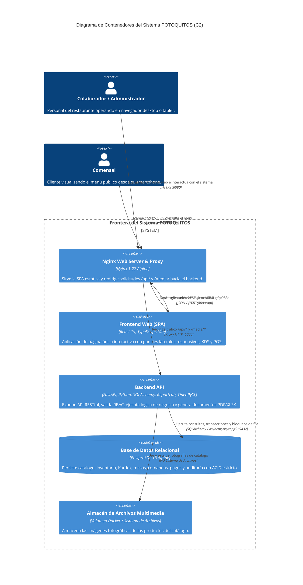

# C2 — Diagrama de Contenedores del Sistema POTOQUITOS

El diagrama de contenedores C2 representa los grandes bloques ejecutables y de almacenamiento que conforman la arquitectura en tiempo de ejecución del sistema **POTOQUITOS**, sus protocolos de comunicación y sus responsabilidades tecnológicas.

> [!NOTE]
> En la terminología C4, un *contenedor* es una unidad de software ejecutable de forma independiente o un almacén de datos (ej. SPA, API REST, Base de Datos), no debe confundirse exclusivamente con un contenedor Docker.

---

## 1. Contenedores del Sistema

| Contenedor C4 | Tecnología | Puerto / Protocolo | Responsabilidad Principal |
| :--- | :--- | :--- | :--- |
| **Frontend Web (SPA)** | React 19, TypeScript, Vite, React Router | HTTPS / Navegador Web | Interfaz gráfica interactiva de usuario (POS, KDS, Caja, Mesas, Inventario, Drawers responsivos). Se ejecuta en el navegador del cliente. |
| **Proxy Inverso & Servidor Web** | Nginx 1.27-alpine | 8080 (Host) / 80 (Docker) • HTTP/1.1 | Sirve los artefactos estáticos de la SPA (`index.html`, bundles JS/CSS) y enruta el tráfico `/api/` y `/media/` hacia el backend. |
| **Backend API** | FastAPI 0.115, Python 3.11/3.14, SQLAlchemy 2.0 | 5000 (Docker) • HTTP/REST JSON | Núcleo de lógica de negocio, autenticación JWT, enforzamiento RBAC, orquestación transaccional (`SqlUnitOfWork`), generación de PDF y Excel. |
| **Base de Datos Relacional** | PostgreSQL 16-alpine | 5432 (Docker) • TCP / SQL | Persistencia relacional ACID, claves foráneas en cascada, índices únicos condicionales y control de concurrencia pesimista (`FOR UPDATE`). |
| **Almacén de Medios** | Sistema de Archivos / Volumen Docker | Volumen `catalog_media` | Almacenamiento local de fotografías de productos del catálogo validadas en formato JPG/PNG/WebP. |

---

## 2. Diagrama C2 (Mermaid)

---

## 3. Flujo de Comunicación entre Contenedores

1. **Carga Inicial de la Aplicación:**
   - El navegador solicita `http://localhost:8080/`.
   - Nginx responde inmediatamente con `dist/index.html` y los paquetes empaquetados por Vite (`assets/index-*.js`, `assets/index-*.css`).
2. **Autenticación e Interacción Operativa:**
   - La SPA emite peticiones asíncronas vía `fetch` hacia `/api/...` adjuntando el encabezado `Authorization: Bearer <token>`.
   - Nginx transfiere la petición a `http://backend:5000/...` preservando las cabeceras `Host`, `X-Real-IP` y `X-Forwarded-For`.
3. **Procesamiento de Negocio en Backend:**
   - FastAPI procesa la solicitud, evalúa el token JWT, valida permisos RBAC mediante `require()`, inicia la transacción mediante `SqlUnitOfWork` y ejecuta la lógica de dominio.
4. **Persistencia y Bloqueo Concurrente:**
   - El backend interactúa con PostgreSQL mediante transacciones coordinadas. En operaciones críticas (como pagos concurrentes o apertura de comanda), aplica `SELECT ... FOR UPDATE` para evitar sobrepagos o condiciones de carrera.
5. **Acceso a Fotografías del Catálogo:**
   - Las solicitudes dirigidas a `/media/products/<filename>` son enrutadas por Nginx hacia el endpoint `/media/products/{filename}` de FastAPI, el cual valida extensiones permitidas, previene ataques de path traversal y retorna la imagen con cabecera `X-Content-Type-Options: nosniff`.
