# C3 — Diagrama de Componentes del Backend POTOQUITOS

El diagrama de componentes C3 descompone el contenedor **Backend API (FastAPI)** en sus módulos lógicos, controladores, servicios de aplicación, repositorios y abstracciones de persistencia reales.

---

## 1. Módulos y Componentes del Backend

### A. Capa de Controladores / Enrutadores (`presentation/`)
- **`AuthRouter` (`auth_routes.py`):** Autenticación, sesión activa, cambio de clave provisional, solicitud de reseteo, CRUD de usuarios y auditoría de accesos.
- **`CatalogRouter` (`catalog_routes.py`):** CRUD de categorías, productos, historial de precios, carga de fotografías y menú público QR.
- **`OrdersRouter` (`orders_routes.py`):** Gestión de mesas, apertura de sesión comensal, comanda borrador, confirmación, despacho a cocina, prefactura y solicitud de cuenta.
- **`KitchenRouter` (`kitchen_routes.py`):** Cola KDS en tiempo real, inicio de preparación (descuento de stock) y marcado de pedidos listos.
- **`InventoryRouter` (`inventory_routes.py`):** Catálogo de ingredientes, recetas por plato, registro de entradas físicas, mermas, ajustes de inventario y consulta de Kardex inmutable.
- **`CashRouter` (`cash_routes.py`):** Gestión de cajas registradoras, apertura de turno, registro de pagos/abonos mixtos, propinas, resumen de cuenta para cobro, arqueo/cierre y emisión de facturas/recibos en PDF.
- **`ExpensesRouter` (`expenses_routes.py`):** Categorización y registro de gastos operativos del restaurante.
- **`AnalyticsRouter` (`analytics_routes.py`):** Métricas operativas en vivo (dashboard), reportes de ventas diarios/mensuales/rango con PDF y exportación contable en Excel (`.xlsx`).
- **`SettingsRouter` (`settings_routes.py`):** Parámetros del restaurante (nombre, NIT, dirección, teléfono, porcentaje de propina sugerida).

### B. Capa de Servicios de Aplicación (`application/` & `infrastructure/`)
- **`AuthService`:** Orquesta la autenticación de tokens JWT, rotación de `token_version` y auditoría de eventos de seguridad.
- **`CatalogService`:** Coordina la validación de precios, almacenamiento de imágenes y versionamiento inmutable de precios (`ProductPriceHistory`).
- **`OrdersService`:** Aplica la máquina de estados de pedidos, garantiza una sola comanda activa por mesa y gestiona transiciones.
- **`PdfReportService` (`pdf_invoice.py`):** Genera mediante ReportLab los comprobantes de factura (`FAC-XXXXXX`), actas de arqueo y reportes gerenciales.
- **`AccountingExportService` (`accounting_export.py`):** Genera mediante OpenPyXL libros contables con tres hojas estilizadas (*Ventas y Cobros*, *Gastos y Egresos*, *Resumen Contable*).

### C. Capa de Persistencia y Repositorios (`infrastructure/`)
- **`SqlUnitOfWork`:** Coordina la sesión transaccional de SQLAlchemy y centraliza los 13 repositorios del sistema:
  1. `AuthRepository` (`m.User`, `m.Role`, `m.Permission`, `m.AuditEvent`)
  2. `CatalogRepository` (`m.Category`, `m.Product`, `m.ProductImage`, `m.ProductPriceHistory`, `m.CatalogAuditEvent`)
  3. `OrdersRepository` (`m.DiningTable`, `m.TableSession`, `m.Order`, `m.OrderLine`, `m.OrderCancellation`)
  4. `KitchenRepository` (Gestión KDS y consumo de recetas)
  5. `InventoryRepository` (`m.Ingredient`, `m.InventoryMovement`, `m.KardexEntry`)
  6. `RecipeRepository` (`m.Recipe`, `m.RecipeItem`)
  7. `CashRepository` (`m.CashRegister`, `m.CashSession`)
  8. `PaymentRepository` (`m.Payment`, `m.PaymentDetail`)
  9. `InvoiceRepository` (`m.Invoice`, `m.InvoiceLine`)
  10. `ExpenseRepository` (`m.ExpenseCategory`, `m.Expense`)
  11. `SettingsRepository` (`m.RestaurantSetting`)
  12. `PredictionsRepository` (Cálculo predictivo de demanda e insumos críticos)
  13. `ReportsRepository` (Agregaciones SQL de ventas, ticket promedio y métodos de pago)

---

## 2. Diagrama C3 del Backend (Mermaid)

```mermaid
C4Component
    title Diagrama de Componentes del Backend API (C3)

    Container(spa, "Frontend Web (SPA)", "React + TypeScript", "Consume la API RESTful mediante peticiones HTTP autenticadas.")
    ContainerDb(db, "PostgreSQL 16", "RDBMS Relacional", "Persistencia ACID de todas las entidades.")

    Container_Boundary(api_boundary, "Backend API (FastAPI)") {

        Component(deps, "Security & Dependencies", "FastAPI Depends", "Resuelve actor autenticado, valida JWT y provee SqlUnitOfWork.")

        Component(auth_r, "Auth Router", "presentation/auth_routes.py", "Endpoints de login, perfil, usuarios, roles y auditoría.")
        Component(cat_r, "Catalog Router", "presentation/catalog_routes.py", "Endpoints de categorías, platos, precios y fotos.")
        Component(ord_r, "Orders Router", "presentation/orders_routes.py", "Endpoints de mesas, comandas, prefactura y cuenta.")
        Component(kit_r, "Kitchen Router", "presentation/kitchen_routes.py", "Endpoints KDS: cola, inicio y entrega de cocina.")
        Component(inv_r, "Inventory Router", "presentation/inventory_routes.py", "Endpoints de ingredientes, recetas, kardex y mermas.")
        Component(cash_r, "Cash Router", "presentation/cash_routes.py", "Endpoints de caja, pagos/abonos, facturas y cierre.")
        Component(exp_r, "Expenses Router", "presentation/expenses_routes.py", "Endpoints de categorías y egresos operativos.")
        Component(ana_r, "Analytics Router", "presentation/analytics_routes.py", "Dashboard, reportes PDF y exportación XLSX.")
        Component(set_r, "Settings Router", "presentation/settings_routes.py", "Configuraciones globales del restaurante.")

        Component(auth_s, "AuthService", "modules/auth", "Lógica de tokens, cambio de clave y autorización.")
        Component(cat_s, "CatalogService", "modules/catalog", "Lógica de productos, recetarios y versionamiento de precios.")
        Component(ord_s, "OrdersService", "modules/orders", "Lógica de comandas, validación de comensales y estados.")
        Component(pdf_s, "PDF Invoice / Report Generator", "infrastructure/pdf_invoice.py", "Renderizado programático de comprobantes con ReportLab.")
        Component(xlsx_s, "Accounting XLSX Exporter", "infrastructure/accounting_export.py", "Generación de libros contables con OpenPyXL.")

        Component(uow, "SqlUnitOfWork", "infrastructure/repositories.py", "Unidad de trabajo transaccional; orquesta los 13 repositorios.")

        Component(repo_auth, "AuthRepository", "infrastructure/repositories.py", "Persistencia de usuarios, roles y auditoría.")
        Component(repo_cat, "CatalogRepository", "infrastructure/repositories.py", "Persistencia de catálogo y precios.")
        Component(repo_ord, "OrdersRepository", "infrastructure/repositories.py", "Persistencia de mesas, sesiones y comandas.")
        Component(repo_kit, "KitchenRepository", "infrastructure/repositories.py", "Cola KDS y descuento atómico de inventario.")
        Component(repo_inv, "Inventory & Recipe Repos", "infrastructure/repositories.py", "Gestión de stock, insumos, recetas y Kardex.")
        Component(repo_cash, "Cash, Payment & Invoice Repos", "infrastructure/repositories.py", "Apertura/cierre de turnos, abonos, pagos y facturas.")
        Component(repo_rep, "Reports & Analytics Repos", "infrastructure/repositories.py", "Agregaciones SQL y cálculo predictivo.")
    }

    Rel(spa, auth_r, "POST /api/auth/login", "JSON")
    Rel(spa, ord_r, "Mesas y pedidos", "JSON")
    Rel(spa, kit_r, "Cola KDS", "JSON")
    Rel(spa, cash_r, "Pagos y caja", "JSON")
    Rel(spa, inv_r, "Stock y Kardex", "JSON")
    Rel(spa, ana_r, "Reportes y exportaciones", "JSON/PDF/XLSX")

    Rel(auth_r, deps, "Usa")
    Rel(ord_r, deps, "Usa")
    Rel(kit_r, deps, "Usa")
    Rel(cash_r, deps, "Usa")

    Rel(deps, uow, "Instancia por solicitud")

    Rel(auth_r, auth_s, "Invoca")
    Rel(cat_r, cat_s, "Invoca")
    Rel(ord_r, ord_s, "Invoca")
    Rel(cash_r, pdf_s, "Genera facturas/arqueos")
    Rel(ana_r, pdf_s, "Genera informes gerenciales")
    Rel(ana_r, xlsx_s, "Genera libro contable")

    Rel(auth_s, uow, "Ejecuta transacciones")
    Rel(cat_s, uow, "Ejecuta transacciones")
    Rel(ord_s, uow, "Ejecuta transacciones")
    Rel(kit_r, uow, "Ejecuta transacciones KDS directamente")
    Rel(cash_r, uow, "Ejecuta pagos y arqueos directamente")
    Rel(inv_r, uow, "Ejecuta movimientos y kardex directamente")

    Rel(uow, repo_auth, "Contiene")
    Rel(uow, repo_cat, "Contiene")
    Rel(uow, repo_ord, "Contiene")
    Rel(uow, repo_kit, "Contiene")
    Rel(uow, repo_inv, "Contiene")
    Rel(uow, repo_cash, "Contiene")
    Rel(uow, repo_rep, "Contiene")

    Rel(repo_auth, db, "SQLAlchemy", "TCP 5432")
    Rel(repo_cat, db, "SQLAlchemy", "TCP 5432")
    Rel(repo_ord, db, "SQLAlchemy", "TCP 5432")
    Rel(repo_kit, db, "SQLAlchemy", "TCP 5432")
    Rel(repo_inv, db, "SQLAlchemy", "TCP 5432")
    Rel(repo_cash, db, "SQLAlchemy", "TCP 5432")
    Rel(repo_rep, db, "SQLAlchemy", "TCP 5432")
```

---

## 3. Observación de Diseño Real: Servicios vs. Repositorios Ricos

Durante la inspección de la arquitectura se identificó el siguiente patrón híbrido pragmático:

1. **Subdominios con Servicios de Aplicación Separados:**
   - `auth`: `AuthService` abstrae el manejo criptográfico de contraseñas, políticas de expiración y generación de tokens JWT.
   - `catalog`: `CatalogService` desacopla el almacenamiento de archivos binarios (`ImageStorage`) de la persistencia relacional.
   - `orders`: `OrdersService` aplica la máquina de estados y las reglas de duplicidad comanda/mesa.
2. **Subdominios con Repositorios Ricos (Rich Repositories):**
   - `kitchen`, `inventory`, `cash`, `expenses`, `reports` y `predictions` implementan la lógica de orquestación directamente en sus repositorios dentro de `repositories.py`.
   - **Razón técnica:** Estos dominios dependen de transacciones atómicas complejas sobre múltiples tablas con bloqueos pesimistas (`with_for_update`) que se resuelven con mayor coherencia y rendimiento directamente en el `SqlUnitOfWork`, evitando capas vacías intermedias que solo reenviarían llamadas sin aportar lógica adicional.
