# C3 — Diagrama de Componentes del Frontend POTOQUITOS

El diagrama de componentes C3 del Frontend representa la estructura modular de la aplicación web SPA construida con **React 19 + TypeScript + Vite**, sus contextos de estado, guardias de seguridad, componentes compartidos y módulos funcionales.

---

## 1. Estructura de Módulos del Frontend

### A. Enrutamiento y Guardias de Acceso (`app/` y `guards/`)
- **`App.tsx`:** Define el árbol de rutas con `react-router-dom`:
  - **Rutas Públicas:** `/login`, `/password-reset` y `/menu` (Menú digital QR).
  - **Rutas Protegidas (`ProtectedRoute`):** Controladas por roles mínimos (`ADMINISTRADOR`, `MESERO`, `COCINA`, `CAJERO`).
- **`ProtectedRoute.tsx`:** Evalúa si el usuario cuenta con token válido; si no está autenticado, redirige a `/login`. Si no posee el rol requerido, redirige a la vista permitida o dashboard.
- **`PermissionGuard.tsx`:** Componente de renderizado condicional para mostrar u ocultar botones o acciones según permisos específicos (ej. `product.change_price`, `table.create`).

### B. Gestión de Estado y Contextos (`contexts/`)
- **`AuthContext.tsx`:** Provee el estado global de la sesión:
  - Almacena el `accessToken` en `localStorage` (o memoria).
  - Decodifica la información del colaborador (`id`, `username`, `first_name`, `last_name`, `roles`, `effective_permissions`).
  - Expone funciones `login()`, `logout()` y `hasPermission(perm)`.

### C. Capa de Presentación Compartida (`components/`)
- **`AppShell.tsx`:** Marco principal de la aplicación:
  - Barra lateral de navegación con enlaces filtrados dinámicamente por rol.
  - Encabezado con datos del colaborador en turno y botón para cambio de credenciales.
  - Soporte responsive con menú colapsable tipo hamburguesa para pantallas móviles y tablets.
- **`Drawer.tsx`:** Panel lateral deslizante reutilizable que entra siempre por la derecha:
  - Soporta tamaños estandarizados: `size="sm"` (480px), `"md"` (680px), `"lg"` (880px), `"xl"` (1040px).
  - En móviles (≤ 540px) se adapta fluidamente al 100vw.
  - Asegura cero scroll horizontal y scroll vertical independiente en `.drawer-body`.
- **`IconButton.tsx`:** Botón accesible para acciones de tabla, iconos de KDS y steppers.

### D. Módulos Funcionales (`features/`)
1. **`auth` (`LoginPage.tsx`, `PasswordResetPage.tsx`):** Inicio de sesión con prevención de fuerza bruta y recuperación de cuenta.
2. **`tables-orders` (`TablesOrdersPage.tsx`):** Salón visual de mesas, apertura de sesión, comanda con 2 modos (Edición con catálogo vs. Consulta bloqueada), prefactura y solicitud de cuenta.
3. **`kitchen` (`KitchenPage.tsx`):** KDS (Kitchen Display System) con tarjetas de pedidos en cola, avance de estados y temporizadores de preparación.
4. **`cash` (`CashPage.tsx`):** Terminal de punto de venta (POS) para caja, recepción de cuentas, pagos parciales/abonos, propinas voluntarias, arqueo con cálculo de diferencia y facturación PDF.
5. **`inventory` (`InventoryPage.tsx`):** Existencias físicas, alertas de stock mínimo, gestión de recetas por plato, entradas de mercancía, mermas y Kardex.
6. **`catalog` (`CatalogProductsPage.tsx`, `PublicMenuPage.tsx`):** Administración de platos, precios, disponibilidad, imágenes y carta pública para clientes.
7. **`expenses` (`ExpensesPage.tsx`):** Registro de costos y egresos fijos/variables clasificados por categoría.
8. **`predictions` (`PredictiveAlertsPage.tsx`):** Alertas de demanda estimada y consumo proyectado de ingredientes.
9. **`reports` (`ReportsPage.tsx`):** Balances de ventas diarias, mensuales y por rango de fechas, con descarga de PDF gerencial y libro contable XLSX.
10. **`users` (`UsersPage.tsx`):** Gestión de colaboradores y reseteo de claves por parte del Administrador.
11. **`settings` (`SettingsPage.tsx`):** Datos fiscales y comerciales del restaurante.

### E. Cliente HTTP de Servicios (`services/`)
- **`api.ts` (`apiRequest<T>`):** Abstracción unificada de `fetch` que inyecta automáticamente el token Bearer, serializa JSON y extrae mensajes normalizados de error ante fallos (`DomainError`).

---

## 2. Diagrama C3 del Frontend (Mermaid)

```mermaid
C4Component
    title Diagrama de Componentes del Frontend SPA (C3)

    Container(nginx, "Nginx / Backend API", "Docker Container", "Recibe peticiones REST y sirve recursos estáticos.")

    Container_Boundary(spa_boundary, "Frontend SPA (React 19 + TypeScript)") {

        Component(router, "App Router", "app/App.tsx", "Define rutas públicas y protegidas con React Router DOM.")
        Component(auth_ctx, "AuthContext", "contexts/AuthContext.tsx", "Mantiene token JWT, usuario activo y permisos RBAC.")
        Component(guard, "Guards", "guards/ProtectedRoute.tsx", "Bloquea rutas según estado de autenticación y rol.")

        Component(shell, "AppShell", "components/AppShell.tsx", "Layout maestro: Sidebar de navegación, header y drawer de perfil.")
        Component(drawer, "Drawer Component", "components/Drawer.tsx", "Panel lateral derecho responsivo (sm, md, lg, xl).")

        Component(page_login, "LoginPage", "features/auth", "Formulario de acceso para colaboradores.")
        Component(page_menu, "PublicMenuPage", "features/catalog/public-menu", "Catálogo digital público para comensales (QR).")
        Component(page_tables, "TablesOrdersPage", "features/tables-orders", "Gestión de mesas, comanda activa y prefactura.")
        Component(page_kitchen, "KitchenPage", "features/kitchen", "Pantalla KDS de preparación y despacho de cocina.")
        Component(page_cash, "CashPage", "features/cash", "Terminal de cobros, abonos, facturas y arqueo de caja.")
        Component(page_inv, "InventoryPage", "features/inventory", "Existencias, recetas, entradas, mermas y Kardex.")
        Component(page_cat, "CatalogProductsPage", "features/catalog/products", "Catálogo, versiones de precios y fotos.")
        Component(page_rep, "ReportsPage", "features/reports", "Reportes de ventas, PDF gerencial y XLSX contable.")
        Component(page_users, "UsersPage", "features/users", "Administración de usuarios y reseteo de claves.")

        Component(api_client, "API Client", "services/api.ts", "Cliente HTTP fetch centralizado con inyección de JWT y manejo de errores.")
    }

    Rel(router, guard, "Verifica permisos de ruta")
    Rel(guard, auth_ctx, "Consulta rol y token")
    Rel(guard, shell, "Renderiza layout si está autorizado")

    Rel(shell, page_tables, "Enruta /tables")
    Rel(shell, page_kitchen, "Enruta /kitchen")
    Rel(shell, page_cash, "Enruta /cash")
    Rel(shell, page_inv, "Enruta /inventory")
    Rel(shell, page_cat, "Enruta /products")
    Rel(shell, page_rep, "Enruta /reports")
    Rel(shell, page_users, "Enruta /users")

    Rel(page_tables, drawer, "Abre comanda, abrir mesa y prefactura")
    Rel(page_cash, drawer, "Abre arqueo de caja y abonos")
    Rel(page_inv, drawer, "Abre entradas, mermas y kardex")
    Rel(page_cat, drawer, "Abre edición de producto y categorías")
    Rel(page_users, drawer, "Abre creación de usuario y clave")

    Rel(page_login, api_client, "POST /auth/login")
    Rel(page_tables, api_client, "GET/POST /tables-orders/...")
    Rel(page_kitchen, api_client, "GET/POST /kitchen/...")
    Rel(page_cash, api_client, "GET/POST /cash/...")
    Rel(page_inv, api_client, "GET/POST /inventory/...")
    Rel(page_cat, api_client, "GET/POST /catalog/...")
    Rel(page_rep, api_client, "GET /analytics/...")

    Rel(api_client, nginx, "Peticiones HTTP REST", "JSON /auth, /tables-orders, /cash, etc.")
```

---

## 3. Patrones de Diseño Utilizados en el Frontend

1. **State Isolation por Módulo:**
   - En lugar de un estado global monolítico (como Redux), cada página mantiene su propio estado reactivo local (`useState`, `useEffect`) y lo sincroniza con el backend mediante intervalos suaves o recargas tras acciones confirmadas.
2. **Componentes Puros de Presentación (Drawers):**
   - El componente `Drawer` recibe su visibilidad (`isOpen`), función de cierre (`onClose`), título, contenido y botones de acción en `footer`, garantizando un comportamiento visual consistente en toda la suite.
3. **Impresión Aislada:**
   - La prefactura y los comprobantes utilizan la clase `.potoquitos-receipt-print-area` combinada con `@media print` en `index.css`, ocultando la interfaz gráfica y renderizando únicamente el comprobante en formato de 80mm para impresoras térmicas.
