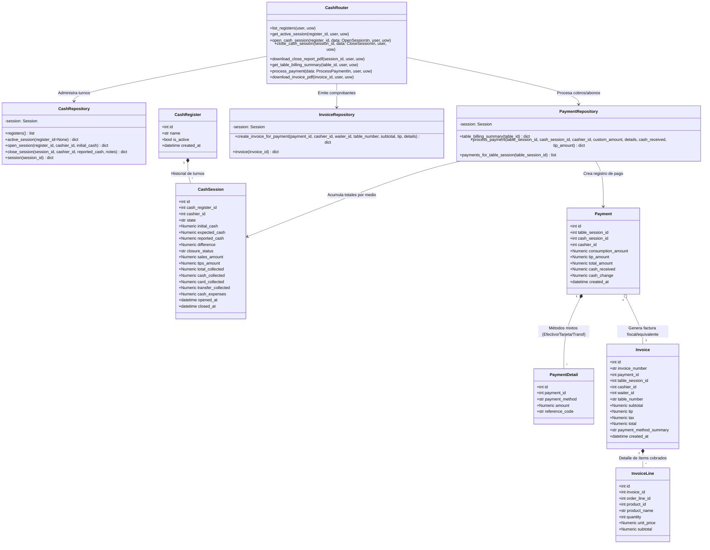

# C4 — Nivel de Código: Caja, Pagos Parciales, Facturación y Cierre

Este diagrama C4 detalla la arquitectura de código implementada para el punto de cobro (POS Caja), la liquidación mediante pagos múltiples o abonos libres, el cálculo exacto de cambio en efectivo, la generación de facturas y el arqueo de cierre de turno.

---

## 1. Elementos Reales del Código

- **Enrutador:** `presentation/cash_routes.py` (`cash_router`)
- **Repositorios:**
  - `infrastructure/repositories.py` (`CashRepository`)
  - `infrastructure/repositories.py` (`PaymentRepository`)
  - `infrastructure/repositories.py` (`InvoiceRepository`)
- **Servicios de Documentos:**
  - `infrastructure/pdf_invoice.py` (`generate_invoice_pdf`, `generate_cash_close_pdf`)
- **Modelos SQLAlchemy:** `infrastructure/models.py`:
  - `CashRegister` (`cash_registers`)
  - `CashSession` (`cash_sessions`)
  - `Payment` (`payments`)
  - `PaymentDetail` (`payment_details`)
  - `Invoice` (`invoices`)
  - `InvoiceLine` (`invoice_lines`)
  - `TableSession` (`table_sessions`)
- **Esquemas Pydantic:** `presentation/cash_routes.py`:
  - `OpenSessionIn`
  - `CloseSessionIn`
  - `ProcessPaymentIn`
  - `PaymentDetailIn`

---

## 2. Diagrama de Clases C4 (Mermaid)



---

## 3. Garantías de Negocio en Código

1. **Abonos Libres y Pagos Múltiples:**
   - En `PaymentRepository.process_payment`:
     - Se valida que `consumption_amount <= pending_balance`. Si se intenta cobrar más del saldo disponible, lanza `AMOUNT_EXCEEDS_BALANCE` (422).
     - Si tras el pago el saldo restante es mayor a $0, la mesa pasa al estado **`PAGO_PARCIAL`** y permanece abierta para recibir abonos adicionales.
     - Únicamente cuando el saldo llega exactamente a $0, la sesión de la mesa se cierra (`state="CLOSED"`) y la mesa física pasa a **`DISPONIBLE`**.
2. **Cálculo Exacto de Cambio en Efectivo:**
   ```python
   if cash_received is not None and cash_received > 0:
       cash_change = max(Decimal("0.00"), Decimal(str(cash_received)) - total_paid_in_cash)
   ```
3. **Discriminación Estricta de Medios en Arqueo:**
   - Solo los abonos en medio `EFECTIVO` suman al efectivo físico esperado en gaveta:
     $$\text{expected\_cash} = \text{initial\_cash} + \text{cash\_collected} - \text{cash\_expenses}$$
   - Los pagos por `TARJETA` o `TRANSFERENCIA` incrementan las ventas globales (`sales_amount`) pero **no** alteran el efectivo en gaveta ni generan descuadres en el arqueo físico.
