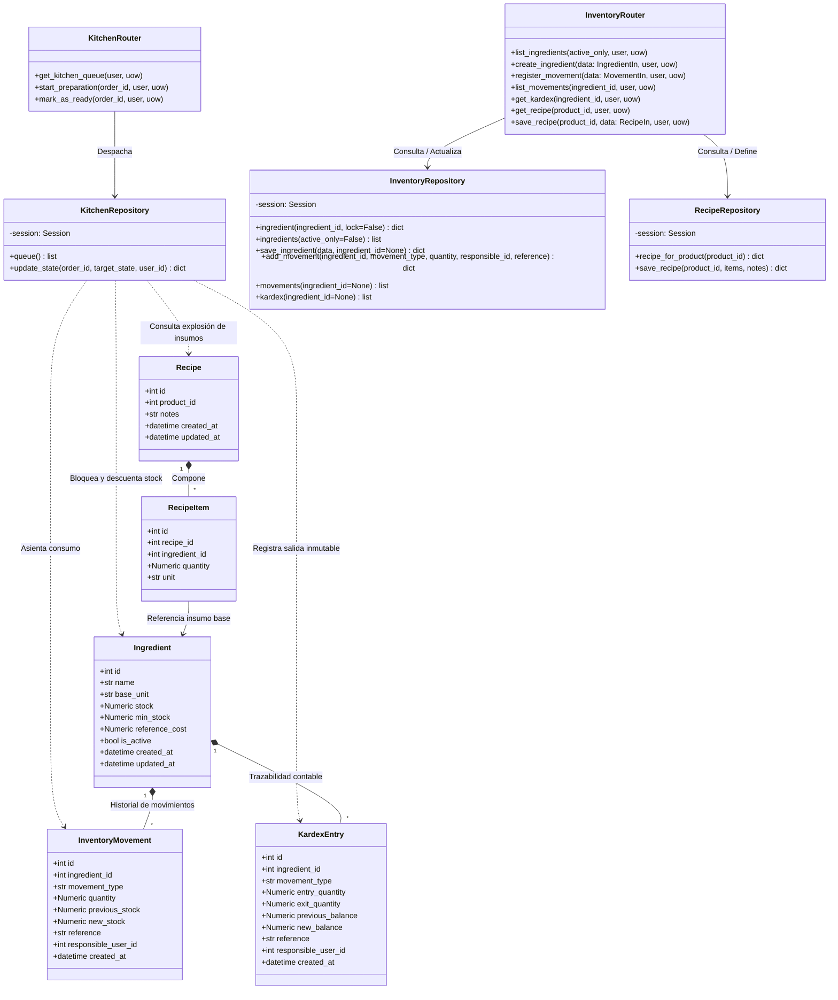

# C4 — Nivel de Código: Cocina, Inventario y Kardex

Este diagrama C4 documenta la interacción a nivel de código entre la gestión de cola KDS en Cocina, la explosión de materiales según Recetario y el descuento transaccional e idempotente en el **Kardex** e Inventario.

---

## 1. Elementos Reales del Código

- **Enrutadores:**
  - `presentation/kitchen_routes.py` (`kitchen_router`)
  - `presentation/inventory_routes.py` (`inventory_router`)
- **Repositorios:**
  - `infrastructure/repositories.py` (`KitchenRepository`)
  - `infrastructure/repositories.py` (`InventoryRepository`)
  - `infrastructure/repositories.py` (`RecipeRepository`)
- **Modelos SQLAlchemy:** `infrastructure/models.py`:
  - `Ingredient` (`ingredients`)
  - `Recipe` (`recipes`)
  - `RecipeItem` (`recipe_items`)
  - `InventoryMovement` (`inventory_movements`)
  - `KardexEntry` (`kardex_entries`)
  - `Order` (`orders`) y `OrderLine` (`order_lines`)
- **Esquemas Pydantic:** `presentation/schemas.py`:
  - `MovementIn`
  - `IngredientIn`
  - `RecipeIn`
  - `RecipeItemIn`

---

## 2. Diagrama de Clases C4 (Mermaid)



---

## 3. Lógica Real de Idempotencia y Descuento en Cocina

En `KitchenRepository.update_state()` (dentro de `repositories.py`):
1. **Validación de Estado Inicial:**
   - La orden debe estar en `CONFIRMADO` o `EN_COCINA`.
2. **Chequeo de Descuento Previo:**
   ```python
   if target_state == "EN_PREPARACION" and not order.inventory_deducted:
       # Se ejecuta la verificación de stock y descuento por receta
       ...
       order.inventory_deducted = True
   ```
3. **Verificación de Stock Físico:**
   - Si el inventario disponible de cualquier ingrediente es menor al requerido, se detiene la transacción y se genera un error atómico `INSUFFICIENT_STOCK` (409).
4. **Idempotencia Absoluta:**
   - Si la comanda ya tenía `inventory_deducted == True`, la preparación se activa sin descontar inventario dos veces.
   - Pasar de `EN_PREPARACION` a `LISTO` **no** vuelve a tocar el inventario.
