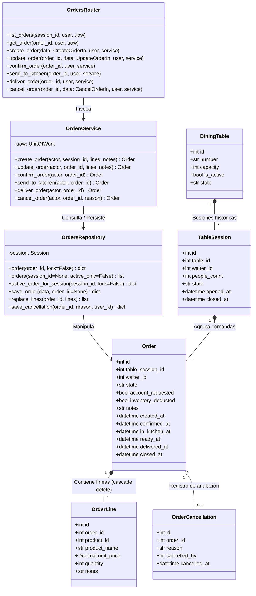

# C4 — Nivel de Código: Dominio de Pedidos y Comandas

Este diagrama C4 detalla la estructura de clases, modelos SQLAlchemy, DTOs Pydantic, repositorios y servicios que componen el flujo de **Pedidos y Comandas** en POTOQUITOS.

---

## 1. Elementos Reales del Código

- **Enrutador:** `presentation/orders_routes.py` (`orders_router`)
- **Servicio de Aplicación:** `modules/orders/application/service.py` (`OrdersService`)
- **Repositorio:** `infrastructure/repositories.py` (`OrdersRepository`)
- **Modelos SQLAlchemy:** `infrastructure/models.py`:
  - `Order` (`orders`)
  - `OrderLine` (`order_lines`)
  - `OrderCancellation` (`order_cancellations`)
  - `TableSession` (`table_sessions`)
  - `DiningTable` (`dining_tables`)
- **Esquemas Pydantic:** `presentation/schemas.py`:
  - `CreateOrderIn`
  - `UpdateOrderIn`
  - `OrderLineIn`
  - `CancelOrderIn`
- **Reglas de Dominio:** `shared/domain/rules.py` (`TRANSITIONS`, `transition()`)

---

## 2. Diagrama de Clases C4 (Mermaid)



---

## 3. Reglas de Validación en Código

1. **Unicidad de Comanda Activa:**
   ```python
   active = self.uow.orders.active_order_for_session(session_id)
   if active:
       raise DomainError("ORDER_ALREADY_EXISTS", "La mesa ya cuenta con una comanda activa.", 409)
   ```
2. **Modificación Restringida a Borrador (`BORRADOR` / `PENDIENTE`):**
   - Una vez que la orden pasa a `EN_PREPARACION`, cualquier intento de `PATCH /orders/{id}` lanza `ORDER_LOCKED` (409), preservando la integridad del stock cocinado.
3. **Entrega Estricta desde Cocina:**
   - Para ejecutar `deliver_order()`, el pedido debe estar estrictamente en estado `LISTO` (`rules.py: transition(current, "ENTREGADO")`).
