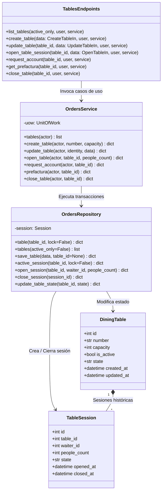
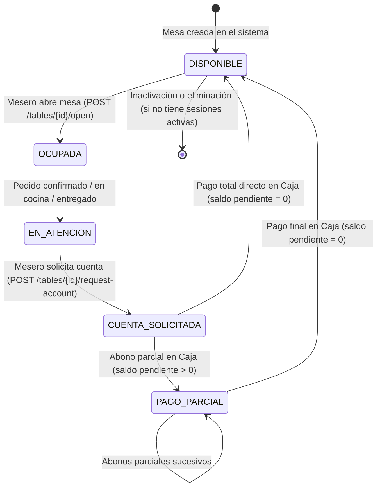

# C4 — Nivel de Código: Mesas y Ciclo de Vida del Salón

Este diagrama C4 documenta la gestión de mesas del salón, la máquina de estados de las sesiones de servicio y el ciclo de vida operativo desde la apertura hasta la liberación final de la mesa.

---

## 1. Elementos Reales del Código

- **Enrutador:** `presentation/orders_routes.py` (Endpoints `/tables-orders/tables/*`)
- **Servicio:** `modules/orders/application/service.py` (`OrdersService`)
- **Repositorio:** `infrastructure/repositories.py` (`OrdersRepository`)
- **Modelos SQLAlchemy:** `infrastructure/models.py`:
  - `DiningTable` (`dining_tables`)
  - `TableSession` (`table_sessions`)
  - `Order` (`orders`)
  - `Payment` (`payments`)
- **Índice Condicional de Base de Datos:**
  - `uq_open_table_session`: Garantiza a nivel PostgreSQL que una mesa solo pueda tener una sesión activa (`state == 'OPEN'`).

---

## 2. Diagrama de Clases C4 (Mermaid)

---

## 3. Máquina de Estados de la Mesa (`DiningTable.state`)

### Reglas de Integridad Implementadas:
1. **Protección contra Inactivación:**
   - No es posible inactivar ni eliminar una mesa que tenga un servicio activo abierto (`TABLE_BUSY` 409).
2. **Protección contra Cobro Prematuro:**
   - La mesa solo es cobrable en Caja (`is_billable: true`) cuando su estado es `CUENTA_SOLICITADA` o `PAGO_PARCIAL`. Intentar cobrar antes genera `ACCOUNT_NOT_REQUESTED` (409) u `ORDER_NOT_DELIVERED` (409).
