# Modelo Entidad-Relación (ERD) — Base de Datos PostgreSQL POTOQUITOS

Este documento detalla el modelo de datos relacional del sistema **POTOQUITOS**, derivado directamente de las declaraciones de modelos en `backend/fastapi_app/infrastructure/models.py` y las migraciones de Alembic.

---

## 1. Diagrama Entidad-Relación (Mermaid `erDiagram`)

```mermaid
erDiagram
    %% ========================================================
    %% AUTENTICACIÓN Y SEGURIDAD (RBAC)
    %% ========================================================
    users {
        int id PK
        string username UK
        string email UK
        string first_name
        string last_name
        string password_hash
        boolean is_active
        boolean must_change_password
        int token_version
        string reset_token_hash
        datetime reset_token_expires_at
        datetime created_at
        datetime updated_at
    }

    roles {
        int id PK
        string name UK
        string description
        datetime created_at
        datetime updated_at
    }

    permissions {
        int id PK
        string codename UK
        string description
        datetime created_at
    }

    user_roles {
        int user_id PK, FK
        int role_id PK, FK
        datetime created_at
    }

    role_permissions {
        int role_id PK, FK
        int permission_id PK, FK
        datetime created_at
    }

    audit_events {
        int id PK
        int actor_user_id FK
        int target_user_id FK
        string action
        json details
        datetime created_at
    }

    users ||--o{ user_roles : "posee"
    roles ||--o{ user_roles : "asignado a"
    roles ||--o{ role_permissions : "contiene"
    permissions ||--o{ role_permissions : "concedido a"
    users ||--o{ audit_events : "genera"

    %% ========================================================
    %% CATÁLOGO Y PRODUCTOS
    %% ========================================================
    catalog_categories {
        int id PK
        string name UK
        text description
        boolean is_active
        int display_order
        datetime created_at
        datetime updated_at
    }

    catalog_products {
        int id PK
        string internal_code UK
        string name
        text description
        numeric current_price
        string currency
        int price_version
        int category_id FK
        int recommended_people
        boolean is_active
        boolean is_available
        int current_image_id FK
        datetime created_at
        datetime updated_at
    }

    catalog_product_images {
        int id PK
        int product_id FK
        string file_reference
        boolean is_current
        datetime created_at
        datetime replaced_at
        int uploaded_by FK
    }

    catalog_product_price_history {
        int id PK
        int product_id FK
        numeric previous_price
        numeric new_price
        string currency
        int price_version
        int changed_by FK
        datetime changed_at
    }

    catalog_categories ||--o{ catalog_products : "agrupa"
    catalog_products ||--o{ catalog_product_images : "fotografías"
    catalog_products ||--o{ catalog_product_price_history : "historial precios"

    %% ========================================================
    %% MESAS, SESIONES Y COMANDAS
    %% ========================================================
    dining_tables {
        int id PK
        string number UK
        int capacity
        boolean is_active
        string state
        datetime created_at
        datetime updated_at
    }

    table_sessions {
        int id PK
        int table_id FK
        int waiter_id FK
        int people_count
        string state
        datetime opened_at
        datetime closed_at
    }

    orders {
        int id PK
        int table_session_id FK
        int waiter_id FK
        string state
        boolean account_requested
        boolean inventory_deducted
        text notes
        datetime created_at
        datetime confirmed_at
        datetime in_kitchen_at
        datetime ready_at
        datetime delivered_at
        datetime closed_at
    }

    order_lines {
        int id PK
        int order_id FK
        int product_id FK
        string product_name
        numeric unit_price
        int quantity
        text notes
    }

    order_cancellations {
        int id PK
        int order_id UK, FK
        text reason
        int cancelled_by FK
        datetime cancelled_at
    }

    dining_tables ||--o{ table_sessions : "historial de atención"
    table_sessions ||--o{ orders : "comandas registradas"
    orders ||--o{ order_lines : "ítems pedidos"
    orders ||--o| order_cancellations : "registro anulación"
    catalog_products ||--o{ order_lines : "producto pedido"
    users ||--o{ table_sessions : "mesero atiende"

    %% ========================================================
    %% RECETARIO, INVENTARIO Y KARDEX
    %% ========================================================
    ingredients {
        int id PK
        string name UK
        text description
        string base_unit
        numeric stock
        numeric min_stock
        numeric reference_cost
        boolean is_active
        datetime created_at
        datetime updated_at
    }

    recipes {
        int id PK
        int product_id UK, FK
        text notes
        datetime created_at
        datetime updated_at
    }

    recipe_items {
        int id PK
        int recipe_id FK
        int ingredient_id FK
        numeric quantity
        string unit
    }

    inventory_movements {
        int id PK
        int ingredient_id FK
        string movement_type
        numeric quantity
        numeric previous_stock
        numeric new_stock
        string reference
        int responsible_user_id FK
        datetime created_at
    }

    kardex_entries {
        int id PK
        int ingredient_id FK
        string movement_type
        numeric entry_quantity
        numeric exit_quantity
        numeric previous_balance
        numeric new_balance
        string reference
        int responsible_user_id FK
        datetime created_at
    }

    catalog_products ||--o| recipes : "receta de producción"
    recipes ||--o{ recipe_items : "ingredientes requeridos"
    ingredients ||--o{ recipe_items : "utilizado en"
    ingredients ||--o{ inventory_movements : "trazabilidad física"
    ingredients ||--o{ kardex_entries : "asientos contables"

    %% ========================================================
    %% CAJA, PAGOS Y FACTURACIÓN
    %% ========================================================
    cash_registers {
        int id PK
        string name UK
        boolean is_active
        datetime created_at
    }

    cash_sessions {
        int id PK
        int cash_register_id FK
        int cashier_id FK
        string state
        numeric initial_cash
        numeric expected_cash
        numeric reported_cash
        numeric difference
        string closure_status
        text notes
        datetime opened_at
        datetime closed_at
        numeric sales_amount
        numeric tips_amount
        numeric total_collected
        numeric cash_collected
        numeric card_collected
        numeric transfer_collected
        numeric cash_expenses
    }

    payments {
        int id PK
        int table_session_id FK
        int cash_session_id FK
        int cashier_id FK
        numeric consumption_amount
        numeric tip_amount
        numeric total_amount
        numeric cash_received
        numeric cash_change
        datetime created_at
    }

    payment_details {
        int id PK
        int payment_id FK
        string payment_method
        numeric amount
        string reference_code
    }

    invoices {
        int id PK
        string invoice_number UK
        int payment_id UK, FK
        int table_session_id FK
        int cashier_id FK
        int waiter_id FK
        string table_number
        numeric subtotal
        numeric tip
        numeric tax
        numeric total
        string payment_method_summary
        datetime created_at
    }

    invoice_lines {
        int id PK
        int invoice_id FK
        int order_line_id FK
        int product_id
        string product_name
        int quantity
        numeric unit_price
        numeric subtotal
    }

    cash_registers ||--o{ cash_sessions : "turnos de caja"
    cash_sessions ||--o{ payments : "pagos cobrados en turno"
    table_sessions ||--o{ payments : "abonos de la cuenta"
    payments ||--o{ payment_details : "desglose medios de pago"
    payments ||--o| invoices : "factura emitida"
    invoices ||--o{ invoice_lines : "renglones facturados"

    %% ========================================================
    %% COSTOS Y GASTOS OPERATIVOS
    %% ========================================================
    expense_categories {
        int id PK
        string name UK
        string description
    }

    expenses {
        int id PK
        int category_id FK
        string concept
        numeric amount
        date expense_date
        int responsible_user_id FK
        text notes
        datetime created_at
    }

    expense_categories ||--o{ expenses : "clasificación de egreso"
    users ||--o{ expenses : "responsable registro"

    %% ========================================================
    %% CONFIGURACIÓN GLOBAL
    %% ========================================================
    restaurant_settings {
        int id PK
        string key UK
        text value
        string description
        datetime updated_at
    }
```

---

## 2. Índices Especiales y Claves Compuestas Reales

| Tabla | Nombre del Índice / Restricción | Tipo | Condición / Definición en Código | Propósito Operativo |
| :--- | :--- | :---: | :--- | :--- |
| `table_sessions` | `uq_open_table_session` | Parcial Único | `table_id WHERE state = 'OPEN'` | Impide que una mesa tenga dos sesiones abiertas simultáneamente en salón. |
| `cash_sessions` | `uq_open_cash_session` | Parcial Único | `cash_register_id WHERE state = 'OPEN'` | Impide que una caja registradora tenga dos turnos de cajero abiertos al mismo tiempo. |
| `catalog_product_images` | `uq_current_product_image` | Parcial Único | `product_id WHERE is_current = TRUE` | Garantiza que cada plato tenga a lo sumo una imagen principal destacada activa. |
| `catalog_categories` | `uq_category_normalized_name` | Único Funcional | `LOWER(TRIM(name))` | Evita duplicidad de nombres de categoría por mayúsculas o espacios. |
| `catalog_products` | `uq_product_normalized_code` | Único Funcional | `UPPER(TRIM(internal_code))` | Garantiza códigos de producto únicos e inmutables (ej. `HAMB-001`). |
| `ingredients` | `uq_ingredient_normalized_name` | Único Funcional | `LOWER(TRIM(name))` | Previene insumos duplicados en compras y recetarios. |
| `catalog_product_price_history` | `uq_price_history_version` | Único Compuesto | `(product_id, price_version)` | Mantiene el historial de precios auditado e inmutable. |
