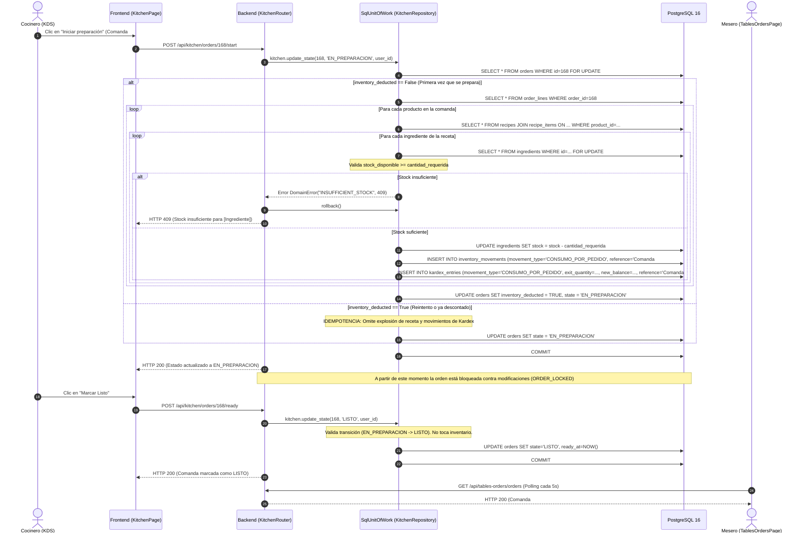

# Diagrama de Secuencia 2: Preparación en Cocina y Descuento Idempotente de Inventario

Este diagrama ilustra el flujo crítico en Cocina cuando se inicia la preparación de una comanda, la validación de stock según el recetario, el descuento atómico de ingredientes, el registro en el **Kardex** inmutable y la garantía estricta de **idempotencia**.

---

