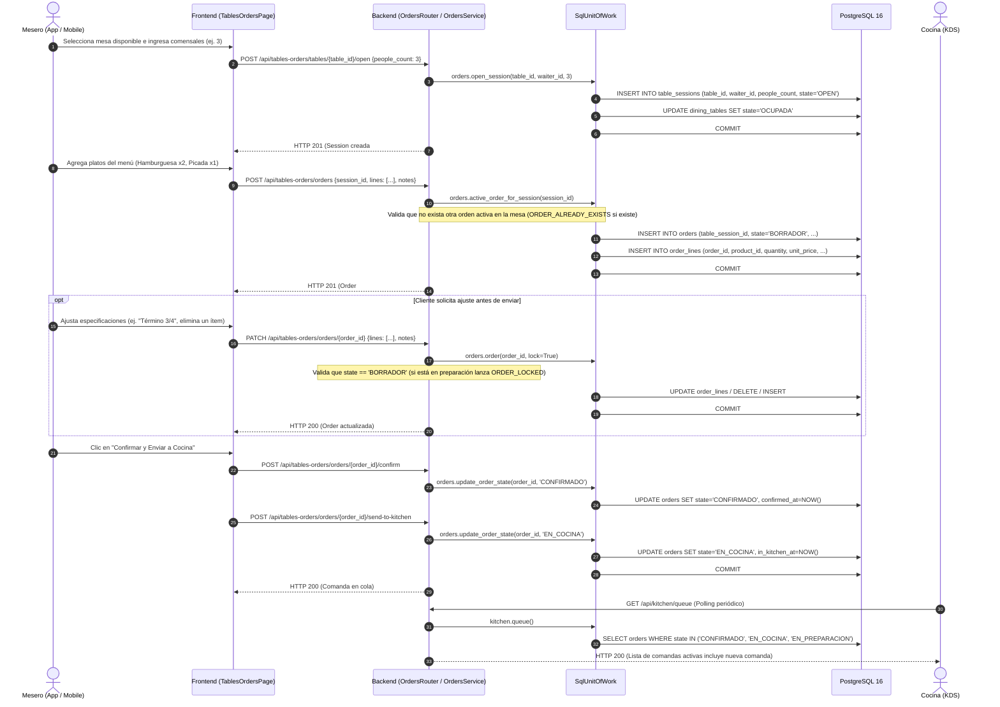

# Diagrama de Secuencia 1: Flujo de Creación y Despacho de Pedido

Este diagrama ilustra el flujo operativo real desde que el Mesero abre la mesa, ingresa los productos en comanda borrador, realiza modificaciones permitidas y confirma el pedido hacia la cola de Cocina.

---

