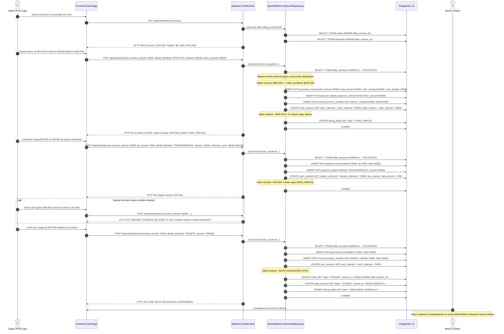

# Diagrama de Secuencia 4: Pagos Múltiples, Abonos Libres y Concurrencia en Caja

Este diagrama representa el soporte integral para múltiples abonos independientes sobre una misma comanda (división de cuenta entre comensales), el cálculo de cambio en efectivo, la protección contra sobrepago, el bloqueo concurrente pesimista (`FOR UPDATE`) y la liberación final de la mesa al liquidar el saldo total a $0.

---

